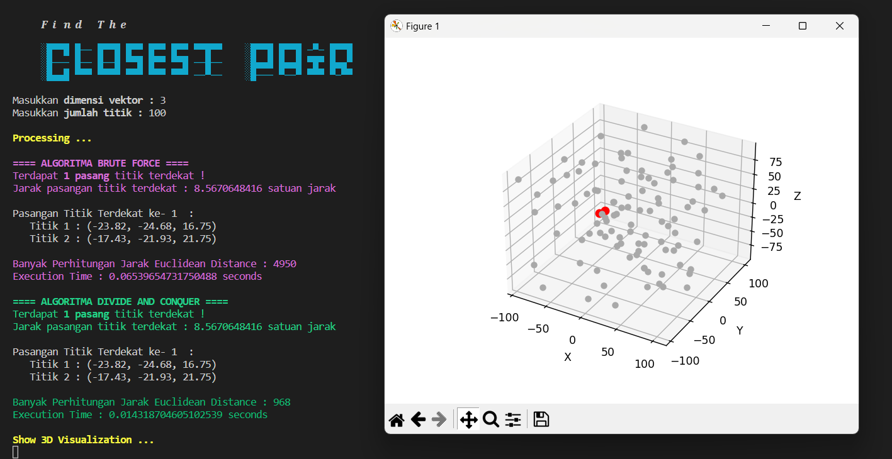

# Tucil2_13521077_13521115
Tugas Kecil II <br> IF2211 Strategi Algoritma Semester II Tahun 2022/2023 <br>Pemanfaatan Algoritma Divide And Conquer dalam Closest Pair 

## Daftar Isi
* [Penjelasan Ringkas Program](#penjelasan-ringkas-program)
* [Penjelasam Algoritma](#penjelasan-algoritma)
* [Requirement Program](#requirement-program)
* [Cara Menjalankan Program](#cara-menjalankan-program)
* [Tampilan Program](#tampilan-program)
* [Struktur Program](#struktur-program)
* [Kontributor](#kontributor)

## Penjelasan Ringkas Program
Find The Closest Pair adalah program untuk mencari sepasang titik terdekat dengan mengimplementasikan Algoritma Divide and Conquer. Program diimplementasikan dalam Bahasa Pemgrograman Python. Program ini berbasis CLI (Command Line Interface) serta penggunaan library `matplotlib` dalam visualisasi hasil pencarian pasangan titik terdekat di bidang 3D. Namun, tidak hanya dalam bidang 3D, program ini juga mampu mencari pasangan titik terdekat pada bidang berdimensi minimum 1D.

## Penjelasan Algoritma
Algoritma Divide and Conquer adalah strategi pemecahan masalah dengan cara membagi permasalahan menjadi subpersoalan yang lebih kecil untuk kemudian ditentukan penyelesaian setiap subpersoalan sehingga dapat dikombinasikan untuk mendapatkan penyelesaian permasalahan secara utuh. Salah satu penerapan penyelesaian permasalahan dengan divide and conquer adalah pada pencarian pasangan titik terdekat atau closest parir. Tujuan dari strategi ini adalah untuk mendapatkan pasangan titik yang jaraknya paling dekat di bidang 3D maupun dimensi lain. Pada dasarnya hal ini dapat dicari dengan menggunakan algoritma brute force dengan memeriksa satu-per-satu jarak antar pasangan titik. Namun, kompleksitas waktu pengerjaan dengan algoritma ini tidak efektif, sehingga diperlukan strategi lain untuk menemukan solusi terbaik, salah satunya dengan strategi divide and conquer. Strategi yang dilakukan adalah dengan membagi 2 wilayah secara seimbang untuk kemudian diperiksa pasangan titik dengan jaraknya paling dekat. Pasangan titik dengan jarak terdekat antar dua wilayah tersebut kemudian dikombinasikan dengan membandingkan nilai keduanya. Hasil perbandingan ini kemudian digunakan untuk menentukan jarak terdekat pasangan titik pada sekitar garis maya pembagi. Langkah-langkah ini dilakukan secara rekursif hingga setiap solusi subpersoalan telah dikombinasikan dan menemukan solusi global permasalahan secara utuh.

## Requirement Program
* Python3
* Instalasi library math dengan mengetikkan `pip install math` pada terminal
* Instalasi library matplotlib dengan mengetikkan `pip install matplotlib` pada terminal
* Instalasi library colorize dengan mengetikkan `pip install colorize` pada terminal
* Visual Studio Code (opsional bisa dijalankan di terminal juga atau dengan IDE lain)

## Cara Menjalankan Program
* Clone atau download program pada repositori pada link [berikut](https://github.com/munzayanahusn/Tucil2_13521077_13521115.git)
* Unzip file hasil download (jika memilih untuk mendownload program)
* Jika menggunakan IDE, seperti Visual Studio Code, `run` program pada file `main.py`
* Jika menggunakan terminal maka arahkan terminal ke direktori file src, kemudian jalankan perintah `python -u main.py`
* Muncul splashscreen sebagai tanda program berhasil dijalankan

**_NOTE:_**  Untuk menjalankan kembali program yang telah berjalan, diperlukan untuk menutup jendela visualisasi terlebih dahulu. 

## Tampilan Program


## Struktur Program
```bash
└───Tucil2_13521077_13521115
    ├───bin
    │   └───
    ├───doc
    │   └───
    ├───src
    │   ├───calculateBruteForce.py
    │   ├───calculateDC.py
    │   ├───main.py
    │   ├───plot.py
    │   ├───quickSortSbX.py
    │   └───tools.py
    ├───program.png
    └───README.md  
```

## Kontributor
* 13521077 Husnia Munzayana
* 13521115 Shelma Salsabila
